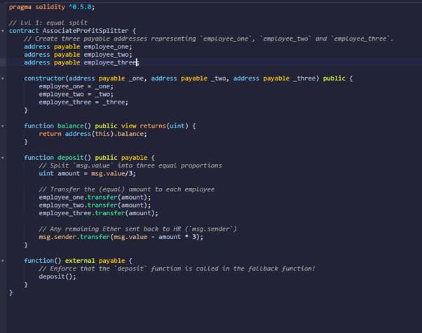
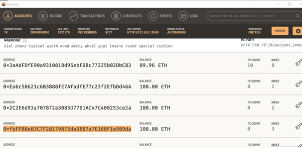
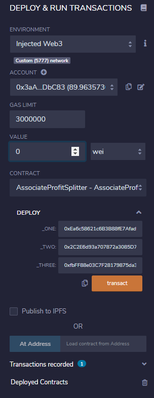
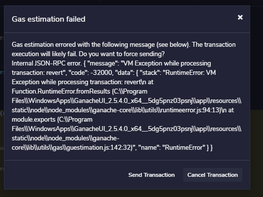
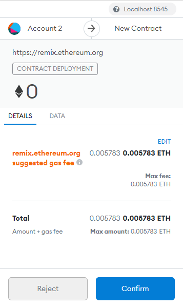
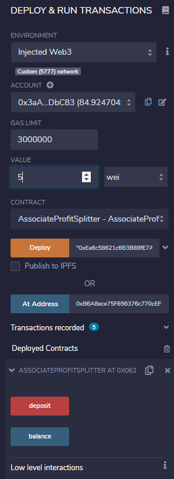
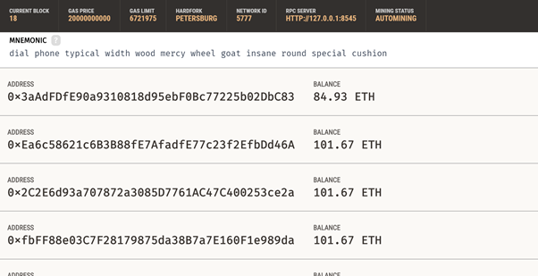

# Week_20_Assignment

# Level One: The AssociateProfitSplitter Contract

## Background and the Contract Tools

Purpose is to build an Ethereum contract using Solidity language, a common tool for developing smart contracts, using the
open source web and desktop application Remix IDE.

* https://remix.ethereum.org/#optimize=false&runs=200&evmVersion=null&version=soljson-v0.5.17+commit.d19bba13.js

The SmartContract provides equal payment to 3 employess of the company, with any outstanding amount being returned to the company (HR).

## Building the Contract

The final code for the AssociateProfitSplitter Contract is provided below as Picture 1 and located within the following folder:

* /AssociateProfitSplitter.sol

Three employees (_one, _two, _three) are created and there addresses called in the constructur. The addresses were obtained using
Ganache (blockchain) and added when the contract was later deployed. The address of the company (HR) was aso obtained
using the Ganache blockchain developer. The starting balance for the 3 employees was 100 ETH while that of the company 89.9 ETH (Picture 2).

The balance of the Sender account is then called to check sufficient funding prior to the transfer.

* function balance() public view returns(uint) {
        return address(this).balance;

Since the employees were to receive equal proprtions of the value paid out by the company, the value of that payment was divieded into 3 through the deposit function,
becoming the new deposit amount for each employee. 

* function deposit() public payable {
        uint amount = msg.value / 3;

These payments were ditributed using the transfer function (of the amount)

* employee_one.transfer(amount);
  employee_two.transfer(amount);
  employee_three.transfer(amount);

In the event any Ether remained of the total pay by the sender (`msg.sender`), after the distribution, this was returned

* msg.sender.transfer(msg.value - amount * 3);
    }

** Testing the Contract

The contract was then deployed to the Ganache blockchain within the Injected Web3 environment and Contract Type Associate Profit Splitter

Transcations made to the addresses as described above.

It is necessary to deploy the contract at 0 value before deploying/paying the value to the contract (Picture 4).

Both the Deploy and then the Deposit need to be confirmed in MetaMask which is a browser add-on that works as a token wallet and exchange within the Eterean blockchain.
The Gas Fee and Amount of deposit are displayed during Confirmation (Picture 5)

A total of 5 Ether was withdrawn from the Company address and deposit successfully and equally into the 3 employee account (PIcture 6 & 7).

